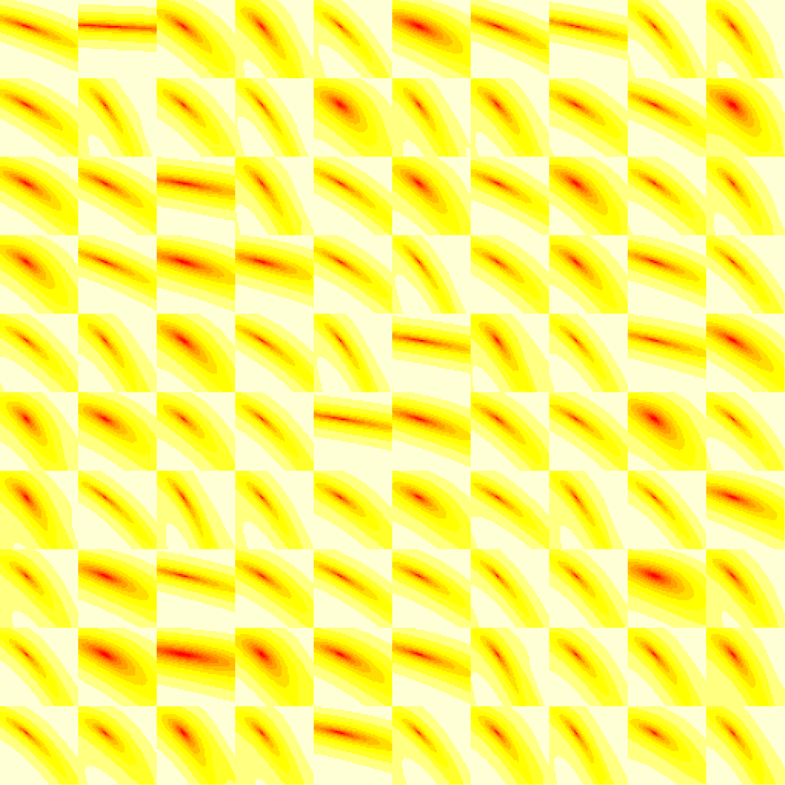

I ran some LHS simulations:

* 100 simulated data sets
* For each data set, 50 parameters were sampled based on the true parameters (using slightly wider range than last time). These values were used as starting parameters for fiting
* Based on the best fit, likelihood surface was created
* Nelder-Mead vs BFGS

```{r setup, message = FALSE}
library(dplyr)
library(fitsir)
library(magrittr) ## for %T>%
library(tidyr)
library(ggplot2); theme_set(theme_bw())
library(gridExtra)
library(emdbook)
load("LHSsim_full.rda")
SIR.logLik <- fitsir:::SIR.logLik
fitsir.optim <- fitsir:::fitsir.optim
g <- SIR.logLik()
```

```{r eval = FALSE, inclue = FALSE}
png("likelihood.png", width = 2560, height = 2560)

par(mfrow = c(10,10), mar = c(0, 0, 0, 0))

lapply(resList, function(x){
    image(x$surface, xaxt = "n", yaxt = "n", bty = "n")
})

dev.off()
```

This is what the likelihood surface looks like when we fix $\gamma, N$ and vary 2 other parameters.



```{r}
## would like to do this as a "functional sequence" if we can figure it out
L_sum <-  . %>% 
    lapply(function(x) data.frame(ll=x$fitted2$ll)) %>%
    bind_rows(.id="run") %>%
    group_by(run) %>%
    mutate(r=rank(-ll),
           rel_nll=(min(ll, na.rm = TRUE)-ll)) ## there's one fit in BFGS that gives NA...

L_comb <- list(NM=L_sum(resList),BFGS=L_sum(resList.grad)) %>%
    bind_rows(.id="optim")

ggplot(L_comb,aes(r,rel_nll,group=run,colour=run))+geom_line()+
    facet_wrap(~optim,scale="free") +
    theme(
        legend.position = "none"
    )
```

Summary:

```{r summary}
## ??? summarise: what fraction are bad, and how much worse is bad
## than best ??
## for each run: fraction that are good (e.g. 40/50) and the
##   difference between top and bottom; the only trick is deciding
##   how big the threshold between good an bad is (e.g. >10 units worse
##   than good = bad

sum_comb <- L_comb %>%
    group_by(run, optim) %>%
    ## ll > 1.01 * max(ll) for number of good fits
    summarize(n = sum(ll < 1.01 * max(ll)), diff = min(ll) - max(ll))

## visualizing BFGS vs NM?

sum_comb %T>%
    print %>%
    summarize(n.diff = -diff(n), ll.diff = diff(diff)) %>%
    gather(key, value, -run) %>%
    ggplot() +
        geom_boxplot(aes(x = 1, y = value)) +
    facet_wrap(~key, scale = "free")
```

What this tells us is that NM always has less bad fits compared to BFGS, and they both have similar differences in maxiumum/minimum likelihood (BFGS gives wider range of parameters and give bad fits more often but they don't have worse log-likelihood compared to the bad fits given by NM).

Now let's look at the trajectories

```{r trajectories, fig.width = 12, fig.height = 12}
n.sample <- 20
set.seed(101)
sample.run <- sort(sample(100, n.sample))

L_dat <- lapply(resList,"[[","data") %>%
    bind_rows(.id="run") %>%
    filter(run %in% sample.run)

get_traj <- function(pars, tvec){
    data.frame(tvec = tvec,
               count = SIR.detsim(tvec, trans.pars(pars)))
}

merge_traj <- function(x){
    with(x,{
        tvec <- data$tvec
        fits <- apply(fitted2, 1, function(x) get_traj(x[-5], tvec)) %>%
            bind_rows(.id = "fit")
        ll <- data.frame(fit = 1:50, ll = fitted2$ll) %>% mutate(rel_ll = (ll - min(ll))/(max(ll) - min(ll))) 
        return(merge(fits, ll))
    })
}

get_fits <- . %>%
    lapply(merge_traj) %>%
    bind_rows(.id = "run") %>%
    mutate(run = factor(run, levels = as.factor(1:n.sample), labels = sample.run))

fit_comb <- list(NM = get_fits(resList[sample.run]), BFGS = get_fits(resList.grad[sample.run]))

g.NM <- ggplot(fit_comb[["NM"]], aes(tvec, count)) + geom_line(aes(group = fit, col = rel_ll)) + 
    facet_wrap(~run, nrow = 4, scale = "free") +
    theme(
        axis.text = element_blank(),
        axis.ticks = element_blank()
    )

g.BFGS <- g.NM %+% fit_comb[["BFGS"]]

g.data <- geom_point(data = L_dat)

grid.arrange(g.NM + g.data + labs(title = "NM") + theme(legend.position = "none"),
    g.BFGS + g.data + labs(title = "BFGS") + theme(axis.title.y = element_blank()),
    nrow = 1,
    widths = c(1, 1.1)
)
```

Left one is showing NM fits. Right one is showing BFGS fits. It looks like they're getting stuck at wrong places. Let's take a look at the nll of those fits:

```{r}
ggplot(L_sum(resList[sample.run]), aes(r, rel_nll, colour = run)) + geom_line()
```

We can see that there are small intermediate steps. Is this a true local minima? Or is the optimizer just getting stuck? It could be a local minima because we're looking at the trajectories of the second fits here... Also, it seems like BFGS gets stuck at different places compared to Nelder-Mead (it seems like they get stuck at small $\gamma$ values and high $\beta$ values?? Maybe looking at the expressions for the gradient will explain something...?). Let's take a look at the distributions first...

```{r dist, fig.width = 8, fig.height = 8}
summarize.pars2 <- . %>%
    lapply("[[", "fitted2") %>%
    bind_rows(.id = "run") %>% ## summarize.pars doesn't work with apply for some reason...
    mutate(R0 = exp(log.beta - log.gamma),
        r = exp(log.beta) - exp(log.gamma),
        N = exp(log.N),
        i0 = plogis(logit.i)
    ) %>%
    select(-c(2:5)) %>%
    as_data_frame

sL <- list(NM = summarize.pars2(resList),
    BFGS = summarize.pars2(resList.grad)
)

sL %>%
    bind_rows(.id = "optim") %>%
    gather(key, value, -run, -ll, -optim) %>%
    mutate(value = ifelse(value < 0, 0, value)) %>%
    ## removing one run with NA ll
    filter(!is.na(ll)) %>%
    ## performing multi-log transformation because we get some extremely large values
    mutate(value = log(log(log(log(log(value + 1) + 1) + 1) + 1) + 1)) %>% 
    group_by(run) %>%
    mutate(fit = ifelse(ll > 1.01 * max(ll, na.rm = TRUE), "good", "bad")) %>%
    ggplot() +
        geom_histogram(aes(x = value, fill = interaction(optim, fit)), bins = 40) +
        facet_wrap(~key, scale = "free") +
        scale_y_sqrt()
```

Note that I used [multi-log transformation](http://www.casagrandi.it/work/ecologia/papers/Dushoff1996.pdf) for the x axis and sqrt scaling for y axis (can't use log10 because of zeroes) so that it's easier to see what's going on (we get a very wide range so it's really difficult to see things without doing this). Also, all values with $r < 0$ were replaced with $r = 0$. We see that most of the bad fits from NM has small $R_0$ and $r$. On the other hand, bad fits from BFGS show different summary statistics (very high $r$ and $R_0$ and small $N$). Finally, we want to look at some of the weird fits...

```{r}
(weirdfit <- resList[[55]]$fitted2[25,-5])
fitsir(resList[[55]]$data, start = weirdfit)
```

I think this one was just getting stuck... Try looking at another one:

```{r}
(weirdfit2 <- resList.grad[[4]]$fitted2[18,-5])
for(i in 1:5){
    if(i == 1){
        f <- fitsir(resList[[4]]$data, start = weirdfit2)
    }else{
        f <- fitsir(resList[[4]]$data, start = coef(f))
    }
}
print(f)
```

Is this one really a local minima? I even tried this with `fitsir.optim` and it still gets stuck at the same place.
```{r}
summarize.pars(weirdfit2)
```

Let's look at the likelihood surface near this point

```{r}
weirdpars <- coef(f)

tmpfun <- function(x, y, 
                   data = resList[[4]]$data,
                   llpars = weirdpars){
    tmp <- llpars
    tmp["log.beta"] <- x
    tmp["logit.i"] <- y
    g(tmp, data$count, data$tvec)
}

cc <- curve3d(tmpfun(x, y),
    xlim = sort(weirdpars["log.beta"]*c(0.8, 1.08)),
    ylim = sort(weirdpars["logit.i"]*c(0.85, 1.15)),
    n = c(51, 51), theta = 30
)

with(cc, image(x, y, log(z-min(z)+1e-5)))
```

Try profiling...? This seems like a local minima, although I would have to look at all four dimensions...

- plot sampling of fits from good and bad components (because 5000 is too many), and distribution
- distribution of R0, r, i/N, N for good and bad fits
- ??? visualize likelihood surface ??? profile ???


Boxplot comparing BFGS and Nelder-Mead

```{r boxplot, fig.width = 10, fig.height = 4}
fit.df <- do.call("rbind", lapply(resList, "[[", 3))
fit.df.grad <- do.call("rbind", lapply(resList.grad, "[[", 3))

fit.df$method <- "NM"; fit.df.grad$method <- "BFGS"

fit.df$sim <- fit.df.grad$sim <- rep(1:100, each = 50)
tot.df <- rbind(fit.df, fit.df.grad)

set.seed(101)
samp.df <- tot.df %>%
    filter(sim %in% sample(100, 20))

organize <- . %>%
    select(-5) %>%
    gather(key, value, -sim, -method)

drawbox <- . %>%
    {ggplot(.) +
        geom_boxplot(aes(x = factor(sim), y = value, col = method), position = "identity") +
        facet_wrap(~key, scale = "free", nrow = 1) +
        theme(axis.title.x=element_blank(),
            axis.text.x=element_blank(),
            axis.ticks.x=element_blank())}

samp.df %>% organize %>% drawbox
```

```{r empty, echo = FALSE, eval = FALSE}
g.box <- samp.df %>% organize %>% drawbox +
    scale_y_continuous(breaks = NULL) + 
    theme(axis.title.y = element_blank(),
        axis.text.y = element_blank(),
        axis.ticks.y = element_blank(),
        panel.grid.minor = element_blank(),
        strip.background = element_blank(),
        strip.text.x = element_blank(),
        legend.position = "none"
    )

ggsave("NMvsBFGS.png", g.box, width = 12, height = 3, dpi = 1200)
```

BFGS is doing weird things... However, if we look at good fits, it seems fine...

```{r goodbox, fig.width = 10, fig.height = 4}
samp.df %>%
    group_by(sim, method) %>%
    filter(ll > 1.01 * max(ll)) %>%
    organize %>%
    drawbox
```
