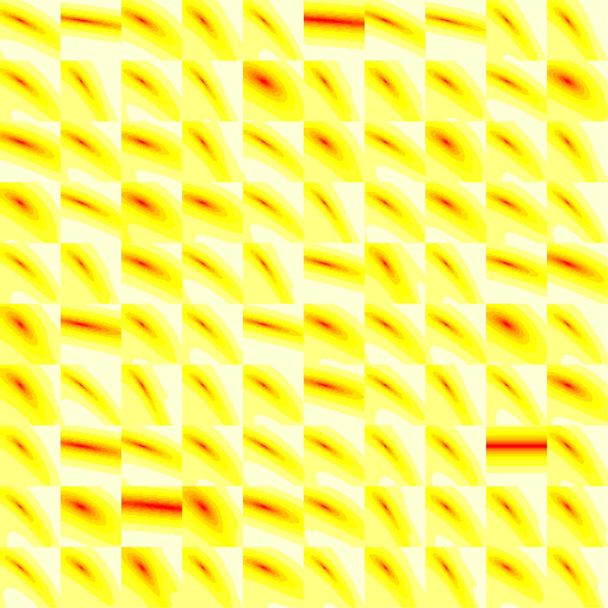

I ran some LHS simulations:

* 100 simulated data sets
* For each data set, 50 parameters were sampled based on the true parameters. These values were used as starting parameters for fiting
* Based on the best fit, likelihood surface was created
* Nelder-Mead vs BFGS

```{r setup, message = FALSE}
library(dplyr)
library(fitsir)
library(magrittr) ## for %T>%
library(tidyr)
library(ggplot2); theme_set(theme_bw())
load("LHSsim_full.rda")
```

```{r eval = FALSE, inclue = FALSE}
png("likelihood.png", width = 2560, height = 2560)

par(mfrow = c(10,10), mar = c(0, 0, 0, 0))

lapply(resList, function(x){
    image(x$surface, xaxt = "n", yaxt = "n", bty = "n")
})

dev.off()
```

This is what the likelihood surface looks like when we fix $\gamma, N$ and vary 2 other parameters.



```{r}
## would like to do this as a "functional sequence" if we can figure it out
L_sum <-  function(.) {
    bind_rows(lapply(.,function(x) data.frame(ll=x$fitted2$ll)),
          .id="run") %>%
    group_by(run) %>%
    mutate(r=rank(-ll),
           rel_nll=(min(ll)-ll))
}
L_comb <- list(NM=L_sum(resList),BFGS=L_sum(resList.grad)) %>%
    bind_rows(.id="optim")
## ??? summarise: what fraction are bad, and how much worse is bad
## than best ??
## for each run: fraction that are good (e.g. 40/50) and the
##   difference between top and bottom; the only trick is deciding
##   how big the threshold between good an bad is (e.g. >10 units worse
##   than good = bad
ggplot(L_comb,aes(r,rel_nll,group=run,colour=run))+geom_line()+
    facet_wrap(~optim,scale="free")
```

```{r}
L_dat <- lapply(resList,"[[","data") %>%
    bind_rows(.id="run")
ggplot(L_dat,aes(tvec,count,group=run))+geom_line()+
    scale_y_log10()
```

- plot sampling of fits from good and bad components (because 5000 is too many), and distribution
- distribution of R0, r, i/N, N for good and bad fits
- ??? visualize likelihood surface ??? profile ???


Boxplot comparing BFGS and Nelder-Mead

```{r boxplot, fig.width = 10, fig.height = 4}
fit.df <- do.call("rbind", lapply(resList, "[[", 3))
fit.df.grad <- do.call("rbind", lapply(resList.grad, "[[", 3))

fit.df$method <- "NM"; fit.df.grad$method <- "BFGS"

fit.df$sim <- fit.df.grad$sim <- rep(1:100, each = 50)
tot.df <- rbind(fit.df, fit.df.grad)

set.seed(100)
samp.df <- tot.df %>%
    filter(sim %in% sample(100, 20))

drawbox <- function(data){
    data %>%
    select(-5) %>%
    gather(key, value, -sim, -method) %>%
    ggplot() +
        geom_boxplot(aes(x = factor(sim), y = value, col = method), position = "identity") +
        facet_wrap(~key, scale = "free", nrow = 1) +
        theme(axis.title.x=element_blank(),
            axis.text.x=element_blank(),
            axis.ticks.x=element_blank())
}

samp.df %>% drawbox
```

```{r empty, echo = FALSE, eval = FALSE}
g.box <- samp.df %>% drawbox +
    scale_y_continuous(breaks = NULL) + 
    theme(axis.title.y = element_blank(),
        axis.text.y = element_blank(),
        axis.ticks.y = element_blank(),
        panel.grid.minor = element_blank(),
        strip.background = element_blank(),
        strip.text.x = element_blank(),
        legend.position = "none"
    )

ggsave("NMvsBFGS.png", g.box, width = 12, height = 3, dpi = 1200)
```

BFGS is doing weird things... However, if we look at good fits, it seems fine...

```{r goodbox, fig.width = 10, fig.height = 4}
samp.df %>%
    group_by(sim, method) %>%
    filter(ll > 1.01 * max(ll)) %>%
    drawbox
```
